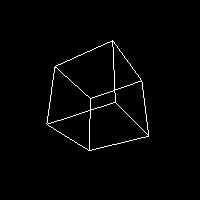

# Offscreen
Offscreen render 3D scene with OpenGL using EGL, GL and GLU. Developed to run on systems with no X server
This is a most simple method to run an offscreen render buffer with python and opengl.
Simplr run: <b>python3 offscreen.py</b> and see the result on testEGL.jpg.

